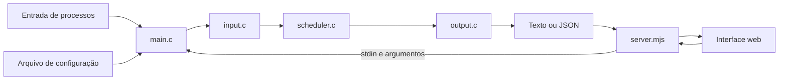

# Guia de código do Process Lab

Este documento explica como o projeto funciona e qual é a responsabilidade de
cada arquivo. A leitura prioriza o núcleo em C, porque é nele que ficam a
validação definitiva, os algoritmos, as métricas e o contrato de saída. A camada
web apenas transporta entradas para esse núcleo e apresenta seus resultados.

## 1. Visão geral do fluxo

Uma execução, pela CLI ou pelo navegador, termina sempre no mesmo motor:



Na linha de comando, `main.c` recebe diretamente os argumentos, o arquivo de
configuração e o `stdin`. Na aplicação web, `server.mjs` transforma a requisição
HTTP nesses mesmos elementos, inicia o executável sem shell e devolve seu JSON.
Assim, não existe uma segunda implementação dos algoritmos em JavaScript.

Uma ordem de leitura recomendada é:

1. `include/scheduler.h`, para conhecer os tipos e o contrato público;
2. `src/main.c`, para entender a coordenação da aplicação;
3. `src/input.c`, para acompanhar a validação da entrada;
4. `src/scheduler.c`, onde estão os algoritmos e as métricas;
5. `src/output.c`, para ver como os resultados são expostos;
6. servidor e interface, para observar os consumidores do motor.

## 2. Núcleo em C

### `include/scheduler.h`: contrato compartilhado

O cabeçalho concentra tudo o que um módulo C precisa conhecer para usar o motor.
Ele evita que `main.c`, `input.c`, `scheduler.c` e `output.c` mantenham definições
duplicadas.

As constantes públicas são:

- `SCHEDULER_MAX_PROCESSES`: limita a entrada a 10.000 processos;
- `SCHEDULER_ERROR_SIZE`: define 256 bytes para os diagnósticos retornados pelas
  funções do motor.

Os tipos principais são:

- `ProcessSpec`: dados imutáveis de um processo — ID, instante de chegada,
  duração total e prioridade estática;
- `SchedulerConfig`: quantum, intensidade do aging, semente pseudoaleatória e a
  opção que ativa o rastreamento;
- `Algorithm`: enumeração dos sete algoritmos e o marcador `ALG_COUNT`, usado
  para dimensionar e percorrer coleções;
- `ProcessMetrics`: primeiro despacho, conclusão, turnaround, espera e resposta
  de um processo;
- `SimulationResult`: resultado completo de uma política, incluindo métricas,
  timeline, médias, trocas de contexto e decisões opcionais.

O rastreamento usa três tipos adicionais:

- `DecisionReason` descreve se o segundo começou ocioso, com despacho,
  continuidade, preempção ou retorno causado pelo fim do quantum;
- `DecisionChoice` informa qual desempate justificou a escolha: critério
  principal, processo atual, menor tempo restante, sorteio ou FIFO;
- `DecisionSnapshot` guarda a CPU anterior, o selecionado, o processo que voltou
  da fatia, o quantum consumido e uma lista de `DecisionCandidate` com o estado
  dos candidatos naquele instante.

As funções públicas formam quatro grupos:

- identificação de algoritmos: `algorithm_key`, `algorithm_label` e
  `parse_algorithm`;
- entrada: `read_config` e `read_processes`;
- simulação e liberação: `simulate` e `free_result`;
- saída: `print_text_result` e `print_json`.

### `src/main.c`: CLI e coordenação

`main.c` não implementa regras de escalonamento. Sua função é validar as opções,
chamar os demais módulos na ordem correta e controlar os recursos alocados.

`OutputFormat` representa os dois formatos possíveis. `usage` imprime a sintaxe da
CLI, enquanto `parse_seed` usa `strtoul`, verifica `errno`, o fim da string e o
limite de `uint32_t` para impedir uma semente parcial ou fora da faixa.

O fluxo de `main` é:

1. inicializar a configuração com semente 42 e rastreamento desativado;
2. percorrer `argv` e reconhecer `--config`, `--algorithm`, `--format`, `--seed`,
   `--trace` e a ajuda;
3. exigir o arquivo de configuração e validar o nome do algoritmo;
4. permitir `--trace` somente com JSON e exatamente um algoritmo;
5. chamar `read_config` e `read_processes`;
6. percorrer `Algorithm` de zero a `ALG_COUNT - 1`, executando todas as políticas
   ou somente a solicitada;
7. delegar a impressão a `output.c`;
8. liberar todos os `SimulationResult` e a lista de processos.

Erros de uso da CLI retornam código 2. Falhas de leitura, validação ou simulação
retornam 1. Uma execução válida retorna 0. O caminho `fail` é importante porque
libera os resultados que já haviam sido produzidos caso um algoritmo posterior
falhe.

### `src/input.c`: leitura e validação

Este arquivo converte texto em `SchedulerConfig` e `ProcessSpec`. Todas as funções
auxiliares são `static`, pois só interessam ao próprio módulo.

- `set_error` centraliza a escrita formatada no buffer de erro do chamador;
- `read_line` lê caractere por caractere, começa com 128 bytes e duplica o buffer
  com `realloc` quando necessário. Ela diferencia linha válida, fim do arquivo e
  erro, e aceita a última linha sem `\n`;
- `trim` remove espaços do início e do fim sem criar uma nova string;
- `parse_nonnegative` lê valores não negativos usados na configuração;
- `parse_integer_token` extrai um inteiro da linha de processo, detecta overflow e
  rejeita caracteres colados ao número;
- `parse_process_line` exige exatamente três inteiros e nenhum conteúdo extra.

`read_config` abre o arquivo e processa linhas no formato `chave:valor`. Linhas
vazias e comentários iniciados por `#` são ignorados. A função rejeita chaves
desconhecidas, valores inválidos, duplicatas, ausência de `quantum` ou `aging` e
quantum igual a zero. O aging pode ser zero.

`read_processes` consome o `FILE *` recebido — na CLI, esse fluxo é `stdin`. O
vetor começa vazio, ganha capacidade inicial para 16 itens e dobra quando fica
cheio. Cada processo recebe `id = posição + 1`, preservando a ordem original da
entrada. A função valida chegada não negativa, duração e prioridade positivas,
limite de 10.000 processos e existência de pelo menos um processo. Em qualquer
falha, libera os buffers antes de retornar `false`.

### `src/scheduler.c`: motor de simulação

Este é o arquivo central do projeto. Ele contém o estado mutável de cada processo,
os três laços de simulação, o desempate, o rastreamento e o cálculo das métricas.

#### Estado interno e limites

`State` representa o ciclo de vida interno:

- `STATE_NEW`: ainda não chegou;
- `STATE_READY`: está apto e esperando CPU;
- `STATE_RUNNING`: ocupa a CPU;
- `STATE_DONE`: terminou.

`Runtime` guarda apenas valores que mudam durante uma execução: tempo restante,
primeiro despacho, conclusão, espera usada pelo aging, prioridade efetiva, ordem
de entrada na fila e estado. A separação entre `ProcessSpec` e `Runtime` garante
que os dados originais permaneçam imutáveis e que cada algoritmo comece com um
estado novo.

`Queue` implementa a fila circular do Round-Robin por meio de vetor, capacidade,
posição da cabeça e quantidade de elementos. `MAX_TIMELINE_SECONDS` limita a
timeline a 10.000.000 de segundos. Quando o trace está ativo,
`MAX_TRACE_CELLS` limita a um milhão o produto aproximado entre duração e número
de processos.

#### Preparação e identificação

`algorithm_key` fornece nomes estáveis para CLI e JSON. `algorithm_label` fornece
rótulos de apresentação. `parse_algorithm` faz a conversão inversa percorrendo a
enumeração.

`prepare` calcula o pior comprimento necessário para a timeline como a maior
chegada somada a todas as durações. Depois, valida os limites, aloca `Runtime`,
métricas, timeline e, quando solicitado, snapshots de decisão. Por fim, inicializa
cada processo com duração restante igual ao burst, tempos ainda desconhecidos
iguais a `-1`, prioridade efetiva original e estado `NEW`.

#### Relógio discreto

Todos os motores avançam um segundo por iteração. A ordem conceitual é:

1. admitir processos cuja chegada ocorreu até o instante atual;
2. escolher ou manter o processo da CPU;
3. registrar a decisão, se o trace estiver ativo;
4. executar o intervalo `[t, t + 1)` com `run_second`;
5. atualizar conclusão, quantum, aging e contadores;
6. incrementar o relógio.

`run_second` escreve `-1` na timeline quando a CPU está ociosa. Caso exista um
selecionado, marca o primeiro despacho, registra seu índice na timeline, reduz o
tempo restante e, ao chegar a zero, marca conclusão em `time + 1`.

#### FCFS, SJF, SRTF e prioridades simples

Esses cinco algoritmos compartilham `simulate_selected`.

`admit_all` move de `NEW` para `READY` todos os processos com
`arrival <= time`. `primary_value` converte a política no valor a minimizar:

- chegada para FCFS;
- tempo restante para SJF e SRTF;
- prioridade estática para as duas políticas de prioridade.

`choose_selected` aplica o desempate comum. Primeiro encontra o melhor valor do
critério. Se o processo atual ainda é candidato e possui esse valor, ele continua.
Caso contrário, vence o menor tempo restante. Se ainda houver empate, uma
amostragem por reservatório escolhe um candidato usando `next_random`.

`next_random` implementa `xorshift32`. O estado começa na semente informada e usa
uma constante não nula quando a semente é zero. Como cada chamada de
`simulate_selected` reinicia o estado a partir da configuração, os resultados são
reproduzíveis e independem da ordem em que os algoritmos foram executados.

`is_preemptive` identifica SRTF e prioridade preemptiva. Em políticas não
preemptivas, `simulate_selected` mantém o processo atual até a conclusão. Nas
preemptivas, devolve o atual a `READY` e repete a escolha a cada segundo. A razão
da decisão é então classificada como ociosidade, despacho, continuidade ou
preempção.

Consequências para cada política:

- FCFS escolhe a menor chegada entre os prontos e não interrompe o selecionado;
- SJF escolhe o menor trabalho restante e não interrompe o selecionado;
- SRTF reavalia o menor trabalho restante a cada segundo;
- prioridade não preemptiva minimiza a prioridade numérica até despachar e então
  executa até o fim;
- prioridade preemptiva reavalia a menor prioridade numérica a cada segundo.

#### Round-Robin

`queue_init`, `queue_push` e `queue_pop` formam uma fila circular FIFO. A
capacidade é `count + 1`, suficiente porque cada processo aparece no máximo uma
vez na fila ou na CPU.

`admit_fifo` insere os recém-chegados e atribui `ready_order` crescente.
`simulate_rr` mantém `current`, `quantum_used` e `pending`. Quando um processo
consome toda a fatia sem concluir, ele é guardado em `pending`. Na iteração
seguinte, `admit_fifo` recebe primeiro as chegadas daquele instante e só depois o
processo pendente volta ao fim da fila. Isso implementa explicitamente a regra de
que chegadas no limite do quantum ficam à frente do processo expirado.

O Round-Robin não usa o desempate comum: a escolha é sempre FIFO. O contador de
quantum é zerado em cada novo despacho. Conclusão remove o processo da rotação;
expiração o prepara para uma futura reinserção.

#### Round-Robin com prioridade e aging

Essa variante mantém a execução até conclusão ou fim da fatia; uma nova chegada
mais prioritária não interrompe o quantum atual.

`admit_priority_fifo` admite chegadas e registra sua ordem. Em vez de uma fila
física, `choose_priority_rr` percorre todos os prontos e escolhe a menor prioridade
efetiva, usando `ready_order` como desempate FIFO.

`age_waiting` incrementa `ready_wait` de cada processo pronto que não executou e
recalcula:

```text
prioridade_efetiva = max(1, prioridade_original - aging × floor(ready_wait / quantum))
```

A melhora ocorre somente após quanta completos de espera. Quando um processo é
despachado, sua espera de aging volta a zero e sua prioridade efetiva retorna à
prioridade original. Esse contador não é a métrica final de espera; serve apenas
para a política de seleção.

`simulate_priority_rr` usa o mesmo mecanismo `pending` para colocar um processo
expirado atrás das chegadas do instante. Após cada segundo, atualiza o aging dos
demais prontos e verifica conclusão ou expiração.

#### Rastreamento de decisões

`record_decision` só faz trabalho quando `config.trace` é verdadeiro. Para cada
segundo, conta os processos `READY` ou `RUNNING`, aloca o vetor de candidatos e
fotografa o estado antes da execução daquele intervalo.

`selection_choice` explica o desempate nas políticas de seleção. A variante com
prioridade usa `priority_rr_choice`, e o Round-Robin simples registra FIFO. Depois
de `run_second`, o motor complementa o snapshot com `completes` ou
`quantum_expires` quando necessário.

Os snapshots são dados produzidos pelo motor, não inferências da interface. Isso
permite avançar ou voltar a animação sem repetir sorteios nem reconstruir filas.

#### Métricas e liberação

`calculate_metrics` deriva, para cada processo:

```text
turnaround = conclusão - chegada
espera     = turnaround - duração
resposta   = primeiro_despacho - chegada
```

As médias são calculadas sobre todos os processos. Uma troca de contexto só é
contada quando dois segundos consecutivos estão ocupados por processos
diferentes; despacho inicial, ociosidade e retorno após ociosidade não contam.

`simulate` é a fachada pública. Ela valida os parâmetros, zera o resultado, chama
`prepare`, direciona RR e RR com prioridade para seus motores próprios e envia as
demais políticas a `simulate_selected`. Se tudo der certo, calcula as métricas.

`free_result` libera cada vetor de candidatos, as métricas, a timeline e os
snapshots, e então zera a estrutura. O zeramento torna a limpeza segura e evita
deixar ponteiros obsoletos no chamador.

### `src/output.c`: texto e JSON

Este módulo não toma decisões de escalonamento; ele apenas transforma
`SimulationResult` em representações externas.

`print_text_result` imprime o nome do algoritmo, médias, trocas de contexto,
métricas individuais e uma tabela por segundo. Na tabela, `##` identifica a CPU,
`--` representa um processo chegado e ainda não concluído e a célula vazia fica
fora do tempo de vida do processo.

`print_json_result` serializa um algoritmo. A timeline associa cada instante a um
ID ou a `null`. Quando há rastreamento, acrescenta `decisions` com razão, tipo de
escolha, estado do quantum e candidatos. Os auxiliares `decision_reason_key` e
`decision_choice_key` convertem enums em strings estáveis.

`print_json` cria o objeto raiz com configuração, processos e resultados. Como os
campos são números, booleanos e rótulos definidos pelo próprio programa, o módulo
não precisa escapar texto fornecido pelo usuário.

## 3. Build e arquivos de apoio

### `Makefile`

O `Makefile` compila com C17, avisos rigorosos e otimização `-O2`. `CPPFLAGS`
adiciona `include/` à busca de cabeçalhos. Os objetos de `src/` são criados em
`build/` e ligados em `scheduler` ou `scheduler.exe`, conforme o sistema.

Os alvos principais são:

- `all`: produz o executável;
- `web`: compila o binário e inicia `web/server.mjs`;
- `clean`: remove `build/`.

### `examples/processes.txt` e `examples/config.txt`

São uma carga e uma configuração prontas para uso nos comandos do README e para
conferir manualmente o comportamento descrito no enunciado.

## 4. Camada web, resumidamente

### `web/server.mjs`

O servidor usa apenas módulos nativos do Node.js e escuta em `127.0.0.1`.
`POST /api/simulate` valida a requisição, cria uma configuração temporária e chama
o binário C com `spawn`, `shell: false`, processos em `stdin` e JSON em `stdout`.
Depois filtra os algoritmos pedidos. `POST /api/trace` repete o fluxo para
exatamente uma política e acrescenta `--trace`.

Há limites de 64 KiB para o corpo, 12 MiB para a saída e cinco segundos para a
execução. O diretório temporário é sempre removido em `finally`. O servidor também
entrega os três arquivos estáticos conhecidos e aplica CSP, `nosniff` e política
de referrer.

### `web/index.html`

Define a estrutura semântica da página: editor de processos, parâmetros,
seletores de algoritmo, tabela comparativa, playback, visualização da decisão,
timeline e métricas. Rótulos, regiões vivas e atalhos declarados dão suporte à
acessibilidade.

### `web/app.js`

Mantém o estado da tela, sincroniza tabela e texto, valida dados antes da
requisição, chama as duas rotas da API e renderiza comparação, timeline, métricas e
fotografias de decisão. O playback apenas percorre resultados já calculados. As
funções específicas de FCFS, tempos restantes, prioridades e quantum convertem o
trace do C em elementos visuais; elas não escolhem processos.

### `web/styles.css`

Concentra tipografia, cores, layout responsivo, tabelas, controles, indicadores de
decisão e transições. Também trata telas estreitas, foco de teclado e a preferência
`prefers-reduced-motion`.

## 5. Documentação e metadados

- `README.md`: apresentação geral, compilação e execução;
- `docs/arquitetura.md`: regras formais dos algoritmos, métricas e decisões de
  arquitetura;
- `docs/guia-de-codigo.md`: explicação arquivo a arquivo da implementação;
- `Tarefa 01 - Escalonamento de Processos.pdf`: enunciado acadêmico que contextualiza
  o projeto;
- `AGENTS.md`: convenções de desenvolvimento e decisões obrigatórias do
  repositório;
- `.gitignore`: exclui build, objetos, logs e arquivos locais do sistema.

## 6. Caminho completo de uma simulação

Para consolidar a leitura, considere o comando com `--algorithm srtf`:

1. `main` interpreta os argumentos e mantém a semente padrão se ela não for
   substituída;
2. `read_config` preenche quantum e aging;
3. `read_processes` cria os `ProcessSpec` e atribui IDs;
4. `simulate` aloca um estado novo e escolhe `simulate_selected`;
5. a cada segundo, `admit_all` recebe chegadas e `choose_selected` escolhe o menor
   tempo restante;
6. `run_second` registra a CPU e reduz a duração restante;
7. ao fim, `calculate_metrics` deriva métricas e trocas;
8. `print_text_result` ou `print_json` publica o resultado;
9. `free_result` e `free(processes)` encerram o ciclo sem manter estado entre
   execuções.

Na interface web, há apenas duas etapas antes desse mesmo caminho: o navegador
envia JSON para `server.mjs`, e o servidor transforma esse JSON em arquivo de
configuração, argumentos e `stdin` para a CLI.
